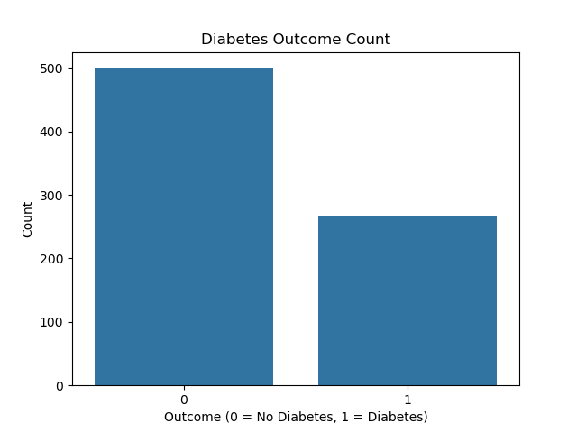
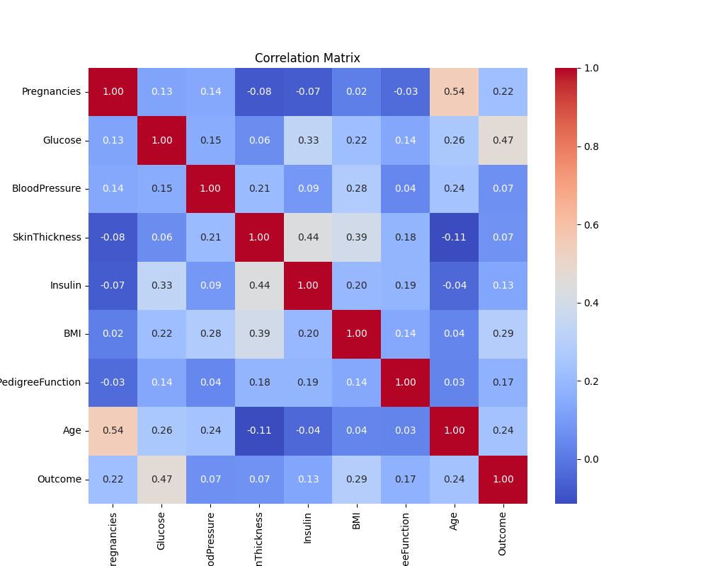
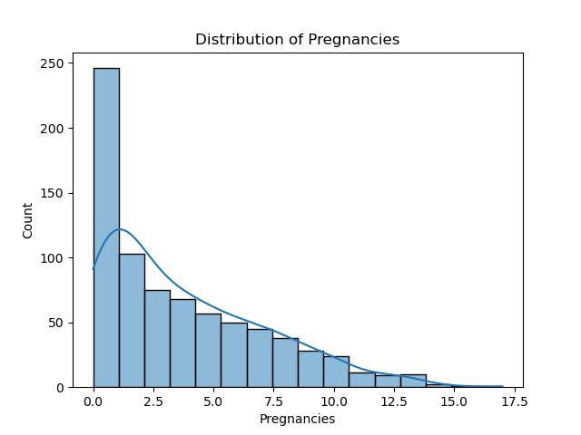
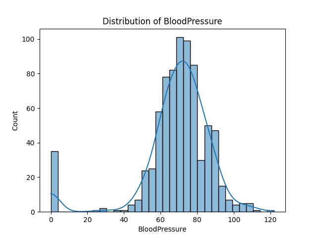
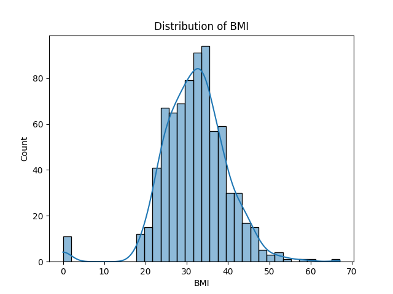
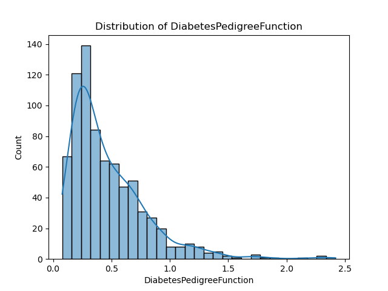
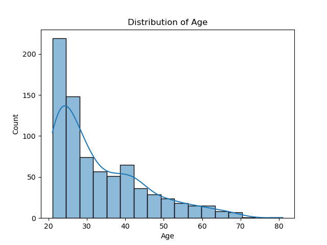

# 📊 Diabetes Data Analysis

This project analyzes the **Pima Indians Diabetes dataset** using Python and libraries like `Pandas`, `Seaborn`, and `Scikit-learn`.  
The goal is to explore the data and build a **Logistic Regression** model to predict diabetes.

---

## 📁 Dataset

- **File:** `diabetes.csv`
- **Target column:** `Outcome`  
  - `0` = No diabetes  
  - `1` = Has diabetes

---

## 🧰 Tools and Libraries

```bash
pip install pandas seaborn scikit-learn matplotlib
```

---

## 📌 Step-by-Step Process

### 1. 📥 Load and Understand the Data

```python
import pandas as pd

df = pd.read_csv("diabetes.csv")
print("🔹 Head:")
print(df.head())
print("🔹 Info:")
print(df.info())
print("🔹 Description:")
print(df.describe())
```

📷 **Preview:**  


---

### 2. 📊 Visualize the Data

#### a. Count of Diabetes Cases

```python
import seaborn as sns
import matplotlib.pyplot as plt

sns.countplot(x='Outcome', data=df)
plt.title("Diabetes Outcome Count")
plt.savefig("images/countplot_outcome.png")
plt.show()
```

📷 

---

#### b. Correlation Heatmap

```python
plt.figure(figsize=(10, 8))
sns.heatmap(df.corr(), annot=True, cmap='coolwarm')
plt.title("Correlation Heatmap")
plt.savefig("images/correlation_heatmap.png")
plt.show()
```

📷 

---

#### c. Feature Distributions (Loop)

```python
for col in df.columns[:-1]:
    sns.histplot(df[col], kde=True)
    plt.title(f'Distribution of {col}')
    plt.savefig(f"images/histplot_{col}.png")
    plt.show()
```

📷 

📷 

📷 

📷 

📷 

📷 

📷 

📷 

---

### 3. 🤖 Train a Logistic Regression Model

#### a. Prepare the Data

```python
from sklearn.model_selection import train_test_split

X = df.drop('Outcome', axis=1)
y = df['Outcome']

X_train, X_test, y_train, y_test = train_test_split(
    X, y, test_size=0.2, random_state=42
)
```

---

#### b. Train and Evaluate

```python
from sklearn.linear_model import LogisticRegression
from sklearn.metrics import accuracy_score

model = LogisticRegression(max_iter=1000)
model.fit(X_train, y_train)
y_pred = model.predict(X_test)

accuracy = accuracy_score(y_test, y_pred)
print(f"Accuracy: {accuracy * 100:.2f}%")
```

📷 

---

## ✅ Results

- Model Accuracy: `XX.XX%` (your output)
- Data is imbalanced (more 0s than 1s), so additional evaluation like **confusion matrix**, **precision**, and **recall** is recommended.

---

## 📁 Folder Structure

```
diabetes-analysis/
│
├── diabetes.csv
├── Diabetes Prediction and Analysis.ipynb
├── README.md
└── images/
    ├── head_info_describe.png
    ├── countplot_outcome.png
    ├── correlation_heatmap.png 
    ├── histplot_Pregnancies.png
    ├── histplot_glucose.png
    ├── histplot_BloodPressure.png
    ├── histplot_SkinThickness.png
    ├── histplot_Insulin.png
    ├── histplot_BMI.png
    ├── histplot_DiabetesPedigreeFunction.png
    ├── histplot_Age.png
    └── logistic_accuracy.png
```
